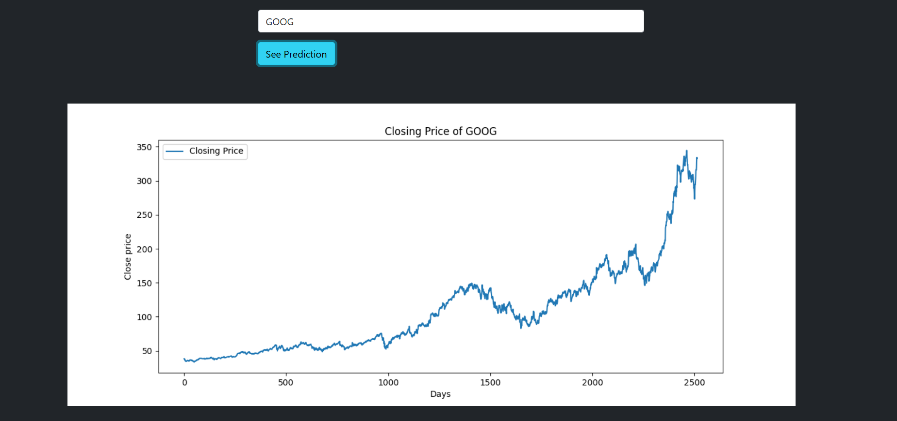
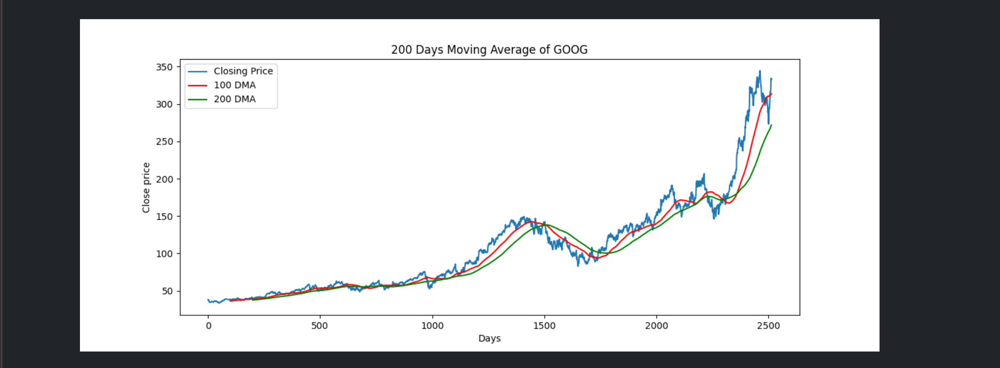

# 📈 Stock Prediction Portal

A full-stack machine learning web application that predicts stock prices using deep learning techniques. The system leverages historical stock data and applies an LSTM-based neural network to forecast future trends.

Includes backend performance optimizations such as **model preloading and API-level caching** for faster and efficient inference.

---

## 🧠 Project Overview

This project combines **Machine Learning + Full Stack Development** to deliver an end-to-end stock prediction platform.

* 📊 Uses historical stock data for prediction
* 🤖 Implements **LSTM (Long Short-Term Memory)** model using Keras
* 🌐 Full-stack architecture with Django REST APIs and React frontend
* 📈 Visualizes stock trends and predictions with interactive graphs

---

## ⚙️ Tech Stack

### 🔹 Backend

* Python
* Django
* Django REST Framework

### 🔹 Frontend

* React.js
* HTML, CSS, JavaScript

### 🔹 Machine Learning

* TensorFlow / Keras
* Pandas, NumPy, Matplotlib
* Scikit-learn

---

## ✨ Features

* 🔐 User Authentication (Login/Register)
* 📥 Input stock ticker (e.g., GOOG, AAPL)
* 📊 Visualize:

  * Closing price trends
  * 100-day moving average
  * 200-day moving average
* 🤖 LSTM-based stock price prediction
* 📉 Model evaluation metrics:

  * MSE
  * RMSE
  * R² Score

---

## ⚡ Performance Optimizations

* 🚀 **Model Preloading**

  * Loaded the trained LSTM model once at server startup instead of per request
  * Reduced inference latency significantly

* ⚡ **API-Level Caching**

  * Implemented Django in-memory caching (LocMemCache)
  * Stored predictions for frequently requested tickers
  * Avoided redundant ML computation and plotting

* 🧠 **Read-Through Cache Strategy**

  * Cache checked before computation
  * On cache miss → compute → store → return
  * On cache hit → instant response

* ⏱️ **Cache Expiry**

  * Configured 10-minute timeout to balance freshness and performance

---

## 📸 Application Screenshots

### 🏠 Landing Page


### 🔐 Login Page


### 📊 Dashboard Input


### 📈 Stock Trends



### 📉 Moving Averages



### 🤖 Prediction Output


---

## 🏗️ System Architecture

```
React Frontend
      ↓
Django REST API
      ↓
Cache Layer (Django LocMemCache)
      ↓
ML Model (Keras LSTM)
      ↓
Data Processing (Pandas, NumPy, yFinance)
```

### 🔍 Flow

1. User enters stock ticker
2. API checks cache

   * ✅ If present → return instantly
   * ❌ If not → fetch data + process + predict
3. Store result in cache
4. Return response to frontend

---

## 🧪 Model Details

* Model Type: LSTM (Recurrent Neural Network)
* Input Features:

  * Historical closing prices
  * Moving averages (100-day, 200-day)
* Data Scaling: MinMaxScaler
* Evaluation Metrics:

  * Mean Squared Error (MSE)
  * Root Mean Squared Error (RMSE)
  * R² Score
* Inference optimized using preloaded model to reduce latency

---

## 🔗 API Endpoints

| Endpoint         | Method | Description          |
| ---------------- | ------ | -------------------- |
| `/api/register/` | POST   | Register user        |
| `/api/token/`    | POST   | Login (JWT)          |
| `/api/predict/`  | POST   | Get stock prediction |

---

## 🧠 Key Learnings

* Designed an end-to-end full-stack ML system
* Optimized backend performance by avoiding repeated model loading
* Implemented caching to reduce redundant computations
* Built scalable API architecture for time-series prediction
* Balanced performance and data freshness using cache expiry

---

## 👨‍💻 Author

**Aditya More**

---
