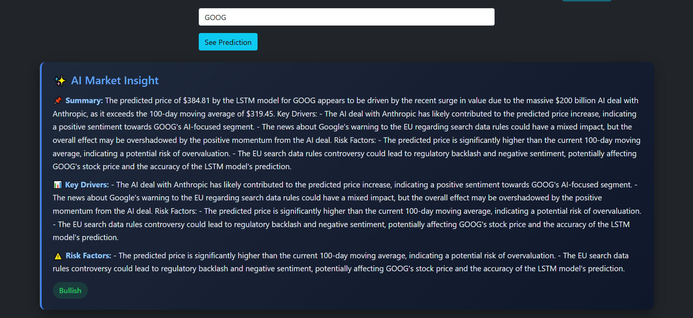
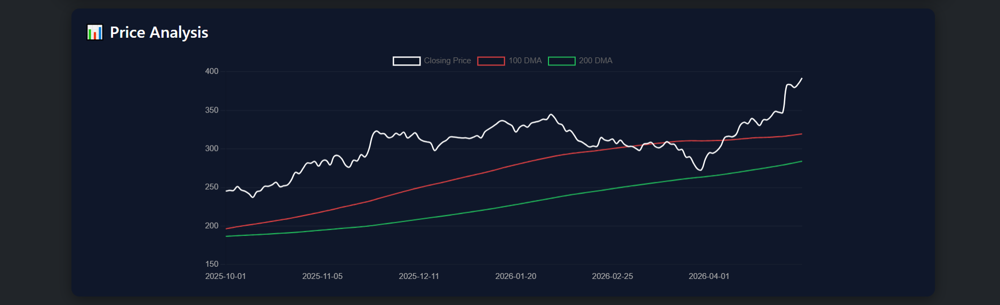
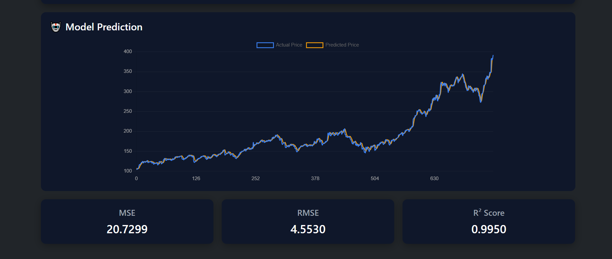

# 📈 Stock Prediction Portal

A full-stack machine learning web application that predicts stock prices using deep learning techniques. The system leverages historical stock data and applies an LSTM-based neural network to forecast future trends.

Additionally, the platform integrates **Generative AI-powered market insights** using LLMs to explain prediction trends based on technical indicators and recent financial news.

Includes backend performance optimizations such as **model preloading and API-level caching** for faster and efficient inference.

---

## 🧠 Project Overview

This project combines **Machine Learning + Generative AI + Full Stack Development** to deliver an end-to-end intelligent stock prediction platform.

* 📊 Uses historical stock data for prediction
* 🤖 Implements **LSTM (Long Short-Term Memory)** model using Keras
* 🧠 Integrates **LLM-powered AI Market Insights**
* 🌐 Full-stack architecture with Django REST APIs and React frontend
* 📈 Visualizes stock trends and predictions with interactive Chart.js graphs
* 📰 Uses financial news headlines to generate contextual AI analysis

---

## ⚙️ Tech Stack

### 🔹 Backend

* Python
* Django
* Django REST Framework

### 🔹 Frontend

* React.js
* Chart.js
* HTML, CSS, JavaScript

### 🔹 Machine Learning

* TensorFlow / Keras
* Pandas, NumPy, Matplotlib
* Scikit-learn

### 🔹 Generative AI

* Groq API
* LLaMA Models
* Prompt Engineering

---

## ✨ Features

* 🔐 User Authentication (Login/Register)
* 📥 Input stock ticker (e.g., GOOG, AAPL)
* 📊 Interactive stock visualizations:

  * Closing price trends
  * 100-day moving average
  * 200-day moving average
  * Actual vs Predicted stock price

* 🤖 LSTM-based stock price prediction

* 🧠 AI-generated market insights including:

  * Summary
  * Key Drivers
  * Risk Factors
  * Market Sentiment

* 📉 Model evaluation metrics:

  * MSE
  * RMSE
  * R² Score

* 🌙 Modern dark-themed analytics dashboard UI

---

## ⚡ Performance Optimizations

* 🚀 **Model Preloading**

  * Loaded the trained LSTM model once at server startup instead of per request
  * Reduced inference latency significantly

* ⚡ **API-Level Caching**

  * Implemented Django in-memory caching (LocMemCache)
  * Stored predictions for frequently requested tickers
  * Avoided redundant ML computation and plotting

* 🧠 **Read-Through Cache Strategy**

  * Cache checked before computation
  * On cache miss → compute → store → return
  * On cache hit → instant response

* ⏱️ **Cache Expiry**

  * Configured 10-minute timeout to balance freshness and performance

---

## 📸 Application Screenshots

### 🏠 Landing Page


### 🔐 Login Page


### 📊 Dashboard


### 🧠 AI Market Insight



### 📈 Price Analysis



### 🤖 Model Prediction



---

## 🏗️ System Architecture

```text
React Frontend
      ↓
Django REST API
      ↓
Cache Layer (Django LocMemCache)
      ↓
ML Model (Keras LSTM)
      ↓
Data Processing (Pandas, NumPy, yFinance)
      ↓
Financial News Fetching
      ↓
LLM Prompt Engineering
      ↓
AI Market Insight Generation
```

### 🔍 Flow

1. User enters stock ticker

2. API checks cache

   * ✅ If present → return instantly
   * ❌ If not → fetch data + process + predict

3. Historical stock data processed

4. LSTM model generates prediction

5. Technical indicators calculated

6. Latest financial news headlines fetched

7. Prompt sent to LLM for AI analysis

8. AI-generated market insight returned

9. Response rendered through interactive React dashboard

---

## 🧪 Model Details

* Model Type: LSTM (Recurrent Neural Network)

* Input Features:

  * Historical closing prices
  * Moving averages (100-day, 200-day)

* Data Scaling: MinMaxScaler

* Evaluation Metrics:

  * Mean Squared Error (MSE)
  * Root Mean Squared Error (RMSE)
  * R² Score

* Inference optimized using preloaded model to reduce latency

---

## 🔗 API Endpoints

| Endpoint | Method | Description |
|----------|--------|-------------|
| `/api/register/` | POST | Register user |
| `/api/token/` | POST | Login (JWT) |
| `/api/predict/` | POST | Get stock prediction + AI market insight |

---

## 🧠 Key Learnings

* Designed an end-to-end full-stack ML system

* Integrated Generative AI with traditional ML workflows

* Built structured prompt engineering for financial analysis

* Optimized backend performance by avoiding repeated model loading

* Implemented caching to reduce redundant computations

* Built scalable API architecture for time-series prediction

* Improved frontend UX using interactive Chart.js visualizations

* Balanced performance and data freshness using cache expiry

---

## 👨‍💻 Author

**Aditya More**

---
